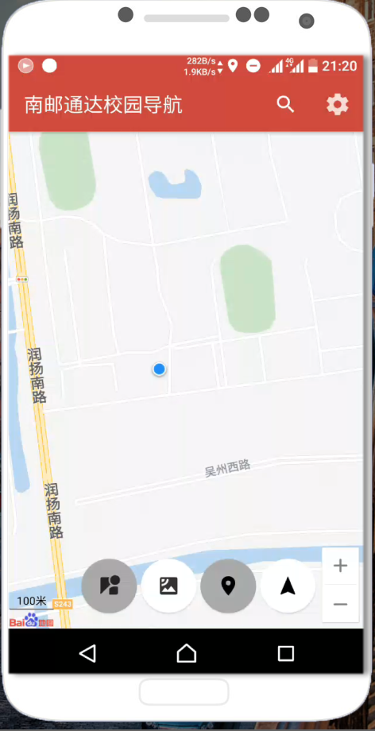

# 项目名称：通达校园导航
## 目标：
### 针对未报道的大一新生，提供一个了解学校及其周边的机会

## 出品：
### 科协计算机部

## APK下载
### [通达校园导航最新版下载](https://github.com/SuperChenSSS/TongDaCampusNavigation/releases/download/V1.1.1-Latest/TongDaNavi1.1.1.apk)

## 项目特点：
- 采用百度地图SDK开发，地图实时更新
- 多种图（全景图、卫星图）快速切换，流畅观赏
- 标注模式下，可直接使用360度全景图无死角观看，学校标志建筑已明显标注
- 相比较于百度地图，我们进行了更加全面的处理，采用了更符合校园导航的UI设计
- 根据实际情况分出了使用GPS的跟随模式，和不使用GPS的游览模式，方便新生根据实际情况选择

## 应用推广：
- 新生开学引导
- 大型校内活动的外来人员引导
- 家长来校引导

## 界面预览：

## 未来发展前景：
- 增加各个地标位置的更加详细的资料
- 可以推广应用到其他高校
- 与教务系统对接，实现与课程安排相结合的提醒和导航